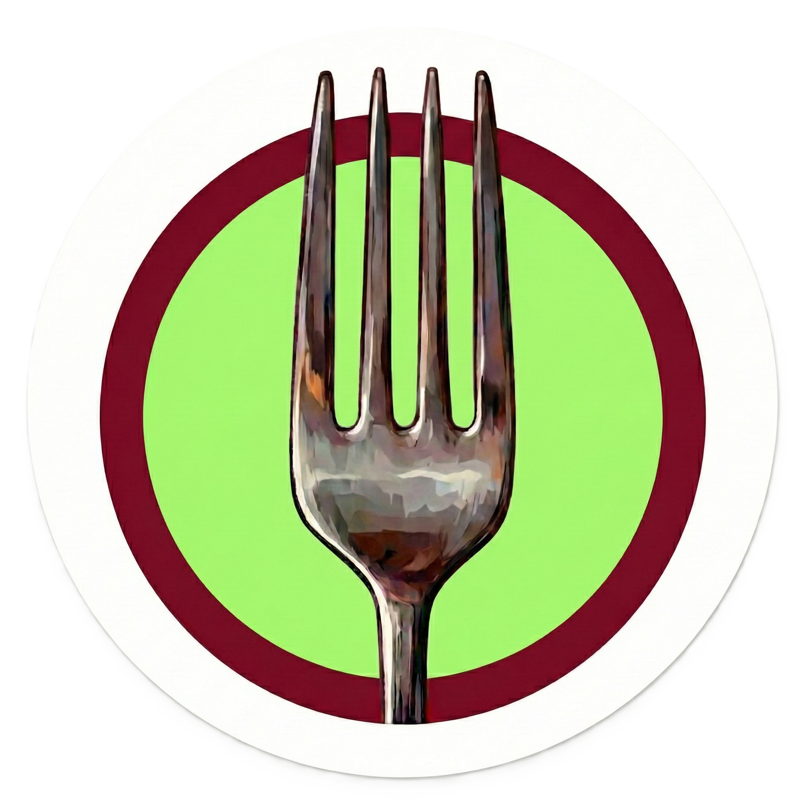

<div align="center">
  
</div>

<div align="center">
  <h1>CULINARY CANVAS</h1>
</div>

Culinary Canvas is a modern, Full-stack food delivery web application designed to provide a seamless & visually appealing experience for both customers and administrators. Built with a robust stack including Next.js, MongoDB, and Tailwind CSS, this platform offers a complete solution for online food ordering, from menu browsing and secure payments to comprehensive admin management.


<div align="center">
  
</div>

**For Customers:**
- **Dynamic Menu:** Browse a rich menu with categories, live search, and detailed item views.
- **Shopping Cart:** A persistent cart that automatically clears after 24 hours of inactivity.
- **Secure Authentication:** User registration, login with credentials or Google, and a secure password reset flow via email.
- **Profile Management:** View order history and upload a custom profile picture (with client-side compression).
- **Multi-Step Checkout:** A guided process for entering delivery details and selecting payment options.
- **Versatile Payments:** Supports Cash on Delivery (COD) and online payments (bKash, Nagad, Card) via the SSLCommerz gateway.
- **Automated Communication:** Receive an HTML order confirmation email upon successful order placement.
- **Order Tracking:** View a post-purchase success page with order details and download a PDF invoice.
- **Auto-Logout:** Sessions automatically expire after 30 minutes of inactivity for enhanced security.

**For Administrators:**
- **Secure Admin Portal:** A dedicated, role-based dashboard protected by NextAuth middleware. Access is granted via a master admin key.
- **Business Analytics:** A comprehensive analytics page to track daily/monthly revenue, total customers, and recent orders with date-filtering capabilities.
- **Full Menu Management (CRUD):** Add, view, edit, and delete menu items directly from the UI. Image uploads are seamlessly handled by Cloudinary.
- **Content Management:** Update and manage the "Best Sellers" section featured on the homepage.
- **Feedback Inbox:** View, manage, and reply to customer feedback and inquiries submitted through the site.
- **Rate Limiting:** API endpoints are protected against abuse using an Upstash Redis-based rate limiter.


<div align="center">
  
</div>

- **Framework:** Next.js (App Router)
- **Database:** MongoDB (with Mongoose and `@next-auth/mongodb-adapter`)
- **Authentication:** NextAuth.js (Credentials & Google Provider)
- **Styling:** Tailwind CSS, Framer Motion
- **Image Management:** Cloudinary
- **Payment Gateway:** SSLCommerz
- **Email Service:** Nodemailer
- **Rate Limiting:** Upstash Redis with `@upstash/ratelimit`
- **Languages:** TypeScript


<div align="center">
  
</div>

To get a local copy up and running, follow these simple steps.

### Prerequisites

- Node.js (v18 or later recommended)
- npm or yarn
- A MongoDB connection URI

### Installation

1.  **Clone the repository:**
    ```sh
    git clone https://github.com/uzicodes/Culinary-Canvas.git
    cd Culinary-Canvas
    ```

2.  **Install dependencies:**
    ```sh
    npm install
    ```

3.  **Set up environment variables:**
    Create a file named `.env.local` in the root of the project and add the necessary variables. See the section below for a complete list.

4.  **Seed the database:**
    This command will populate your MongoDB database with the initial menu items.
    ```sh
    node seed.ts
    ```

5.  **Run the development server:**
    ```sh
    npm run dev
    ```
    The application will be available at `http://localhost:3000`.


<div align="center">
  
</div>

You need to create a `.env.local` file and add the following configuration variables for the application to function correctly.

```env
# MongoDB
MONGODB_URI=your_mongodb_connection_string

# NextAuth
NEXTAUTH_URL=http://localhost:3000
NEXTAUTH_SECRET=your_nextauth_secret
GOOGLE_CLIENT_ID=your_google_client_id
GOOGLE_CLIENT_SECRET=your_google_client_secret

# Admin Master Key (used for admin login)
NEXT_PUBLIC_MASTER_ADMIN_KEY=your_secure_master_key

# Nodemailer (for password reset emails)
EMAIL_USER=your_gmail_address
EMAIL_PASS=your_gmail_app_password

# SSLCommerz Payment Gateway
SSLCOMMERZ_STORE_ID=your_sslcommerz_store_id
SSLCOMMERZ_STORE_PASSWORD=your_sslcommerz_store_password
SSLCOMMERZ_IS_LIVE=false # Set to 'true' for production

# Base URL for API callbacks
NEXT_PUBLIC_BASE_URL=http://localhost:3000

# Cloudinary (for image uploads)
NEXT_PUBLIC_CLOUDINARY_CLOUD_NAME=your_cloudinary_cloud_name
NEXT_PUBLIC_CLOUDINARY_UPLOAD_PRESET=your_cloudinary_upload_preset
CLOUDINARY_API_KEY=your_cloudinary_api_key
CLOUDINARY_API_SECRET=your_cloudinary_api_secret

# Upstash Redis (for rate limiting)
UPSTASH_REDIS_REST_URL=your_upstash_redis_url
UPSTASH_REDIS_REST_TOKEN=your_upstash_redis_token
```


<div align="center">
  
</div>

The repository is organized using the Next.js App Router structure:

-   `src/app/`: Contains all pages, API routes, and UI layout.
    -   `src/app/api/`: All backend API endpoints for authentication, data handling, and payment processing.
    -   `src/app/admin/`: Protected routes for the administrator dashboard.
    -   `src/app/(user)/`: Public-facing pages like `/cart`, `/checkout`, `/profile`, etc.
-   `src/components/`: Reusable React components used across the application (e.g., `Header`, `Footer`, `Hero`).
-   `src/lib/`: Core utility functions, database connection (`mongodb.ts`), and service integrations.
-   `src/models/`: Mongoose schemas for database collections (`Order`, `Member`, `Feedback`).
-   `src/hooks/`: Custom React hooks, such as `useAutoLogout`.
-   `public/`: Static assets including fonts and images.
-   `seed.ts`: A script to populate the database with initial menu data.
